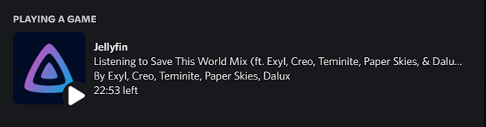
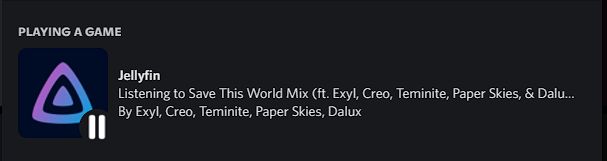

# MBCord (fork from oonqt)

     

## MBCord is a Discord rich presence client for [Jellyfin](https://jellyfin.org) and [Emby](https://emby.media/)

### Maintained by me. With newest Dependencies and Bugfixes.

### First time or looking for some answers? Check out the [Wiki](https://github.com/oonqt/MBCord/wiki)

### Looking for downloads? Check out the [releases page](https://github.com/oonqt/mbcord/releases)

### Jellyfin Playing:

##### Jellyfin Paused:

